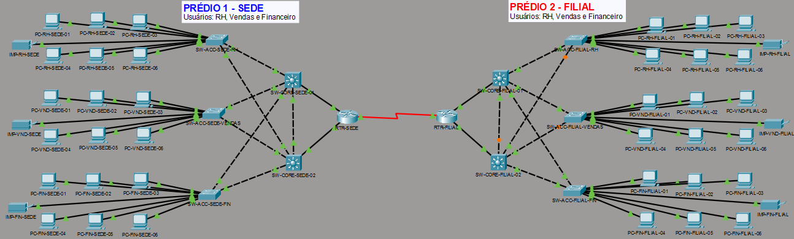

# 🌐 Infraestrutura de Rede Corporativa Multi-Site (Sede & Filial)

Proposta de arquitetura de rede híbrida de alta disponibilidade desenvolvida no **Cisco Packet Tracer**, interligando a Sede e uma Filial por meio de links WAN dedicados, segmentação por VLANs e encaminhamento em Camada 2/3.


---

## 📌 Visão Geral da Topologia

A infraestrutura foi projetada seguindo o **Modelo Hierárquico de Redes Cisco (Core, Distribution e Access)** para garantir escalabilidade, segurança e redundância de links.

```plaintext
+-------------------+
              |   LINK WAN (Serial)|
              |   10.10.100.0/30  |
              +---------+---------+
                        |
       +----------------+----------------+
       |                                 |
+--------+--------+               +--------+--------+
|  Router RTR-SEDE|               |Router RTR-FILIAL|
+--------+--------+               +--------+--------+
|                                 |
+--------+--------+               +--------+--------+
| SW-CORE-SEDE-01 |               |SW-CORE-FILIAL-01|
| SW-CORE-SEDE-02 |               |SW-CORE-FILIAL-02|
+--------+--------+               +--------+--------+
|                                 |
+--------+--------+               +--------+--------+
| Switches Acesso |               | Switches Acesso |
| (RH/VND/FIN)    |               | (RH/VND/FIN)    |
+-----------------+               +-----------------+
```
---

## 🛠️ Tecnologias e Funcionalidades Implementadas

- **Encaminhamento L3 (Inter-VLAN Routing):** Configurado em Switches Multicamada via interfaces virtuais de comutação (SVIs).
- **Segmentação de Tráfego (VLANs):** Divisão lógica dos departamentos (RH, Vendas, Financeiro) em sub-redes isoladas.
- **Trunking (IEEE 802.1Q):** Enlace de troncos configurado entre os switches de acesso e o Core/Distribuição.
- **Redundância e Proteção L2 (STP - Spanning Tree Protocol):** Mitigação de tempestades de broadcast e loops na Camada 2 com failover automático.
- **Roteamento Estático WAN:** Comunicação end-to-end entre os sites da Sede e Filial via interfaces Seriais.
- **Atribuição Dinâmica e Estática de IP:** Serviços DHCP configurados nos Switches Multicamada e reservas estáticas aplicadas às impressoras de rede.

---

## 📐 Esquema de Endereçamento IP e VLANs

### 🏢 PRÉDIO 1 - SEDE
| Departamento / Uso | VLAN | Sub-rede / Máscara | Gateway Padrão (SVI) | IP da Impressora |
| :--- | :---: | :---: | :---: | :---: |
| **Recursos Humanos** | `VLAN 10` | `192.168.10.0/24` | `192.168.10.1` | `192.168.10.250` |
| **Vendas** | `VLAN 20` | `192.168.20.0/24` | `192.168.20.1` | `192.168.20.250` |
| **Financeiro** | `VLAN 30` | `192.168.30.0/24` | `192.168.30.1` | `192.168.30.250` |
| **Link Router-Switch** | - | `10.10.1.0/30` | `10.10.1.5` | - |

### 🏢 PRÉDIO 2 - FILIAL
| Departamento / Uso | VLAN | Sub-rede / Máscara | Gateway Padrão (SVI) | IP da Impressora |
| :--- | :---: | :---: | :---: | :---: |
| **Recursos Humanos** | `VLAN 40` | `192.168.40.0/24` | `192.168.40.1` | `192.168.40.250` |
| **Vendas** | `VLAN 50` | `192.168.50.0/24` | `192.168.50.1` | `192.168.50.250` |
| **Financeiro** | `VLAN 60` | `192.168.60.0/24` | `192.168.60.1` | `192.168.60.250` |
| **Link Router-Switch** | - | `10.10.2.0/30` | `10.10.2.5` | - |

### 🌐 ENLACE WAN (SERIAL)
| Dispositivo | Interface | Endereço IP | Sub-rede |
| :--- | :--- | :--- | :--- |
| **RTR-SEDE** | `Serial0/3/0` | `10.10.100.1` | `255.255.255.252 (/30)` |
| **RTR-FILIAL** | `Serial0/3/0` | `10.10.100.2` | `255.255.255.252 (/30)` |

---

## ⚙️ Configurações Principais (Exemplos de CLI)

### 1. Configuração do Enlace Trunk nos Switches de Acesso
```text
SW-ACC-SEDE-RH(config)# vlan 10,20,30
SW-ACC-SEDE-RH(config)# interface range fa0/1 - 2
SW-ACC-SEDE-RH(config-if-range)# switchport mode trunk
```
2. Habilitação de Roteamento L3 e SVIs no Core Switch

```plain text
SW-CORE-SEDE-01(config)# ip routing
SW-CORE-SEDE-01(config)# interface vlan 10
SW-CORE-SEDE-01(config-if)# ip address 192.168.10.1 255.255.255.0
SW-CORE-SEDE-01(config-if)# no shutdown
SW-CORE-SEDE-01(config)# ip route 0.0.0.0 0.0.0.0 10.10.1.5
```

3. Tabela de Roteamento WAN no Roteador de Borda

```plain text
RTR-SEDE(config)# ip route 10.10.2.0 255.255.255.0 10.10.100.2
RTR-SEDE(config)# ip route 192.168.40.0 255.255.255.0 10.10.100.2
RTR-SEDE(config)# ip route 192.168.50.0 255.255.255.0 10.10.100.2
RTR-SEDE(config)# ip route 192.168.60.0 255.255.255.0 10.10.100.2
```

🧪 Testes de Conectividade e Validação
Validação de VLAN e Trunking Local:

Comando executado: show interfaces trunk

Resultado: Todas as VLANs permitidas (10,20,30 na Sede e 40,50,60 na Filial) no estado Forwarding.

Teste de Failover do Spanning Tree (STP):

Simulação de desconexão física de um cabo de acesso. O link redundante assumiu o estado ativo de forma automática sem queda na comunicação.

Ping de Ponta a Ponta (End-to-End):

Teste realizado a partir do PC-RH-SEDE-01 (VLAN 10) até ao PC-RH-FILIAL-01 (VLAN 40) via CLI Command Prompt:

```plain text
C:\> ping 192.168.40.10
Pinging 192.168.40.10 with 32 bytes of data:
Reply from 192.168.40.10: bytes=32 time=2ms TTL=125
```
📁 Como Executar este Projeto
Faça o download do arquivo de topologia .pkt disponível no repositório.

Abra o arquivo no Cisco Packet Tracer (Versão 8.0 ou superior).

Aguarde a conversão inicial dos estados do Spanning Tree (as portas estabilizarão em verde/laranja).

Abra o terminal de qualquer estação de trabalho (PC) e faça testes de ping ou traceroute para verificar a comunicação entre os Prédios 1 e 2.

[📥 Baixar o projeto de topologia (.pkt)](topologia-matriz-filial.pkt)

[](topologia-matriz-filial.pkt)


